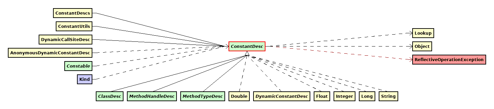

# Java 12 - new features 

Features with their ratings:
* :+1: useful
* :-1: removed
* :disappointed: not available
* :confused: no added value

## :+1: JShell usability improvements
See JShell help for more details
```
$ jshell
|  Welcome to JShell -- Version 12
|  For an introduction type: /help intro


jshell> /help
|  ...
|
|  Subjects:
|  
|  intro
|       an introduction to the jshell tool
|  keys
|       a description of readline-like input editing
|  id
|       a description of snippet IDs and how use them
|  shortcuts
|       a description of keystrokes for snippet and command completion,
|       information access, and automatic code generation
|  context
|       a description of the evaluation context options for /env /reload and /reset
|  rerun
|       a description of ways to re-evaluate previously entered snippets


jshell> /help keys
|  
|                                    keys
|                                    ====
|  
|  The jshell tool provides line editing support to allow you to navigate within
|  and edit snippets and commands. The current command/snippet can be edited,
|  or prior commands/snippets can be retrieved from history, edited, and executed.
|  This support is similar to readline/editline with simple emacs-like bindings.
|  There are also jshell tool specific key sequences.
|
|  ...
```

You can try the following code snippets in `jshell`.

## :-1: ~326: Raw String Literals (Preview)~
Feature removed. For good.  
There are 2 leftovers in `String`:
### :confused: transform
How to rewrite this snippet
```java
Integer.parseInt( "65536" )
```
in overcomplicated and overweighted way?

Here you are:
```java
"65536".transform( Integer::parseInt )
```

### :confused: indent
Would you like to format your JSON?  
You are expecting too much from Java.
But you can adjust indentation:

```java
var jsonInner = "'name': 'OpenJDK',\n'version': 12\n".replace( '\'', '"' );
System.out.println( jsonInner );
var jsonOuter = "{\n" + jsonInner.indent( 4 ) + "}\n";
System.out.println( jsonOuter );
System.out.println( jsonOuter.indent( -8 ) );
```

## :disappointed: 325: Switch Expressions (Preview)

By using switch expressions with default configuration, you will see an error:
```
|  Error:
|  switch expressions are a preview feature and are disabled by default.
|    (use --enable-preview to enable switch expressions)
```

You have to enable this feature first:
```
/usr/lib/jvm/java-12-openjdk/bin/jshell --enable-preview
```

Then you can use it:
```java
String developerRating( int numberOfChildren ) {
    return switch (numberOfChildren) {
        case 0 -> "open source contributor";
        case 1 -> "junior";
        case 2 -> "senior";
        case 3 -> "expert";
        default -> {
            if (numberOfChildren < 0) throw new IndexOutOfBoundsException( numberOfChildren );
            break "manager";
        }
    };
}

developerRating( 0 );
developerRating( 4 );
```

## Other extensions to the standard library
### CompactNumberFormat
### Files.mismatch

```java
Files.mismatch( Paths.get("doesn't exist"), Paths.get("doesn't exist") )
```
gives result `-1` - means the 2 non existing files are equal.  
Is this what you would expect?

### Collectors.teeing

## :confused: 334: JVM Constants API
Maybe relevant for tools like Class Visualizer. Otherwise no added value.

Please don't be surprise by new super-interfaces added to some core classes - shown below
(diagrams generated by [Class Visualizer](http://class-visualizer.net/):




## Prformance improvements
### :confused: 341: Default CDS Archives
Nothing new - unless you are building custom JRE images.

### :disappointed: 189: Shenandoah: A Low-Pause-Time Garbage Collector (Experimental)
Included in RedHat build.

:disappointed: Not included in the official build from Oracle.

```
$ java -XX:+UseShenandoahGC
Error: VM option 'UseShenandoahGC' is experimental and must be enabled via -XX:+UnlockExperimentalVMOptions.

$ java -XX:+UnlockExperimentalVMOptions -XX:+UseShenandoahGC
Error occurred during initialization of VM
Option -XX:+UseShenandoahGC not supported
```

### :question: 344: Abortable Mixed Collections for G1
Status unclear.

## :disappointed: 346: Promptly Return Unused Committed Memory from G1
Made in :switzerland:  
:disappointed: switched off by default.

## :confused: 230: Microbenchmark Suite
## :confused: 340: One AArch64 Port, Not Two

# Leftovers from version 11
## :-1: JDK Mission Control 7
:-1: All builds are removed.
